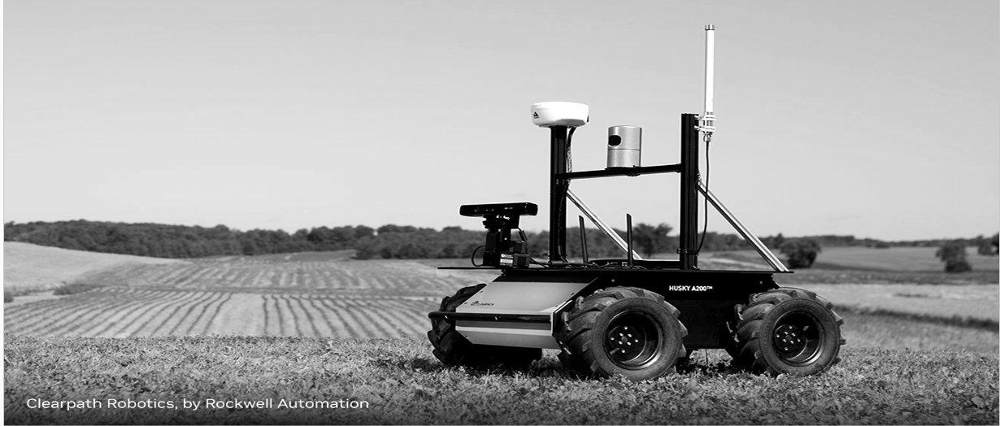
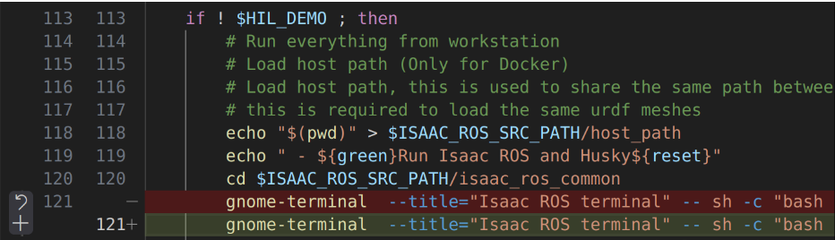
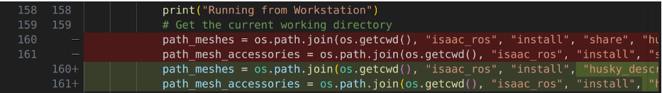
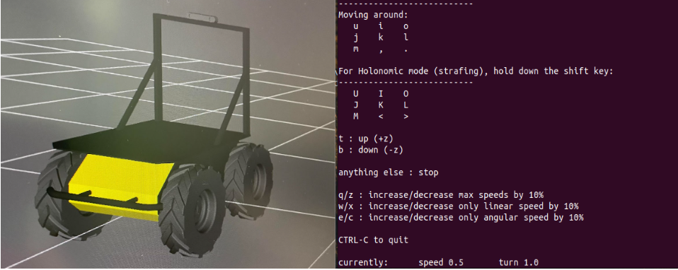
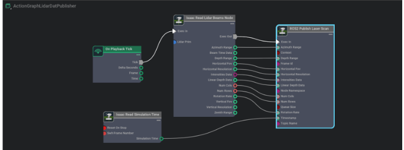
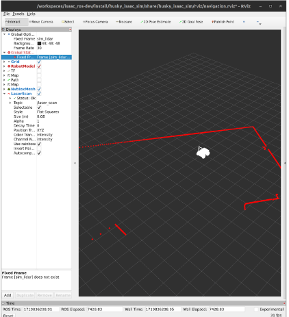
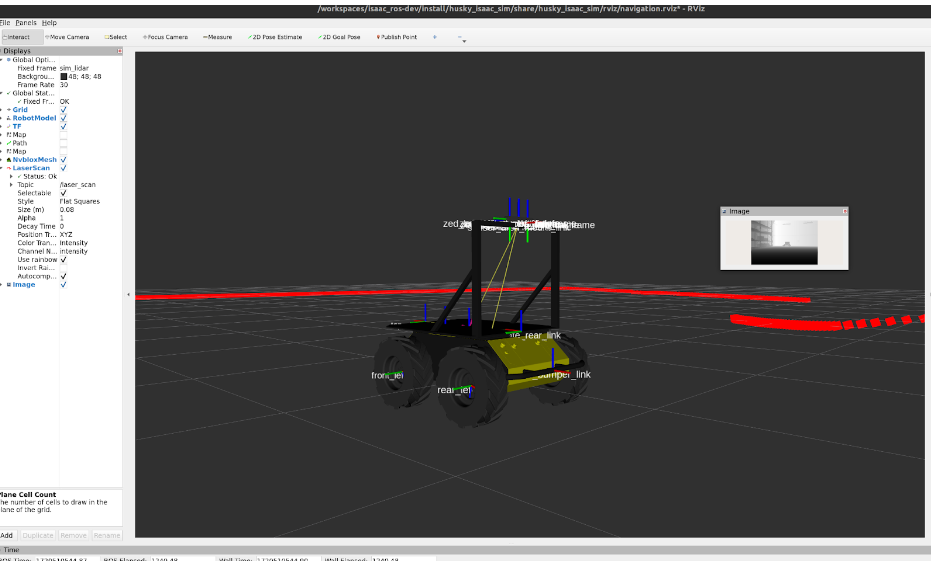
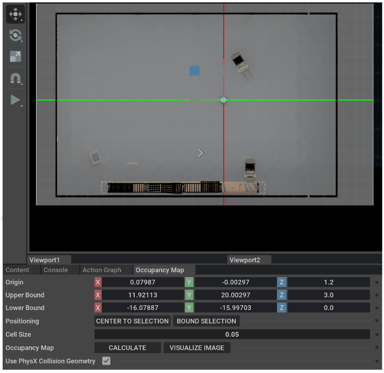
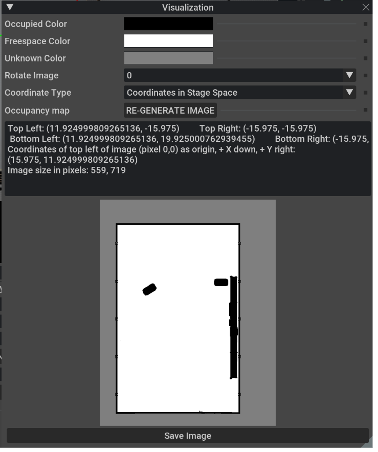
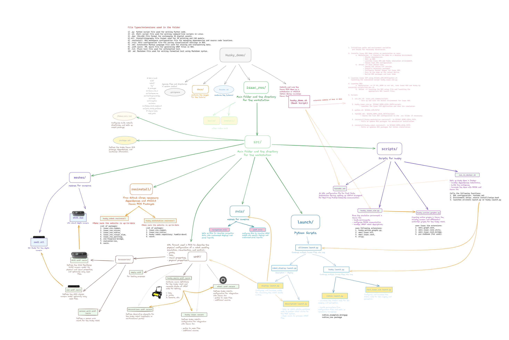

# Husky Virtual Commissioning


## Hardware required

1. Internet connection
2. x86/64 machine
3. Install Ubuntu 22.04
4. Install ROS2 Humble
5. NVIDIA Graphic card with RTX
6. Display, Keyboard, and Mouse

## [📚🔗📝🎓💡🌐 ---> Resources Notion Page](https://adventurous-cowbell-f88.notion.site/Bookmarks-Resources-c1a5f2631f6248309d7fc9ab8f682d7a?pvs=4)

**Husky – ROS2 Navigation with Omniverse ISAACSIM**

The aim of this project is to streamline the commissioning process of robotic systems, focusing on the Husky robot, through the integration of ROS2 for navigation and Omniverse ISAAC SIM for simulation. 

# **STEP 1**

***Workstation, Installation, Running***

We need a workstation with NVIDIARTXGPUand the latest versions of both [NVIDIA Isaac Sim ](https://developer.nvidia.com/isaac-sim)and [ROS2 Humble ](https://docs.ros.org/en/humble/Installation.html)installed.

Follow this tutorial to download ROS2 Humble and its dependencies.

- Here you can edit the bashrc so that ros2 is automatically sourced every time you open a terminal, instead of manually sourcing it every time you start a new shell session.

Follow this tutorial to download Isaac Sim.

- First you should make sure that the device is compatible and then download the omniverse launcher. This willbe the hub where all the omniverse features can be accessed, including Isaac Sim.

For the following steps we willbe following the Husky Demo tutorial with minor edits to correct the bash and python scripts: <https://github.com/NVIDIA-AI-IOT/husky_demo/blob/main/README.md>

 # **STEP 2**

Clone the demo to try it on workstation using the following script:

  ```bash
  git clone <https://github.com/NVIDIA-AI-IOT/husky_demo.git>

  cd husky_demo
  ```

## **Step 2.5**

Before we move to the next step we have found several errors in the scripts in the husky_demo folder.

1. Edit husky_demo.sh:

   - Open ```husky_demo.sh```
   - Find line 121, which should be a part of ```if ! $HIL_DEMO ; then``` section.
   - Edit by adding -d in front of ```$ISAAC_ROS_PATH``` this ensures that the workspace is created using a correct directory.
   - The corrected line should look like this: ```gnome-terminal --title="Isaac ROS terminal" -- sh -c "bash -c \"scripts/run_dev.sh -d $ISAAC_ROS_PATH; exec bash\""```




2. Edit huksy_isaac_sim.py:
   - Open ```huksy_isaac_sim.py```
   - Find lines 160-161 under ```callback_description``` method.
   - Correct path to meshes and mesh accessories. This willensure that husky robots willhave meshes in Isaac Sim.
   - Incorrect version willhave install/share which is a wrong path:

```bash
  path_meshes = os.path.join(os.getcwd(), "isaac_ros", "install", "share", "husky_description", "meshes")

  path_mesh_accessories = os.path.join(os.getcwd(), "isaac_ros", "install", "share", "husky_isaac_sim", "meshes")
  ```

  - Correct version will have ```install/share/husky_description and install/share/husky_isaac_sim:```
    
```bash
path_meshes = os.path.join(os.getcwd(), "isaac_ros", "install", "husky_description", "share", "husky_description", "meshes") 
path_mesh_accessories = os.path.join(os.getcwd(), "isaac_ros", "install", "husky_isaac_sim", "share", "husky_isaac_sim", "meshes")
  ```




# **Step 3**

After running it,use the following command to start Isaac Sim and open a new terminal with Docker built to use Isaac ROSand all packages needed for the demo:
 
```bash
./husky_demo.sh
```
After you run this a new terminal should appear called Isaac Ros Terminal. Check that you are in a correct directory by comparing the contents of isaac_ros in husky_demo folder to the workspace directory by running the following command:   ```ls```

The output should most likely contain src and .gitignore

## **Step 3.5**

Next, we need to Colcon build to compile and build the packages in our workspace. If there are new install and build folders inside of your husky_demo folder remove it
```bash
rm -rf install/ 
rm -rf build/
```

Next, run the following command:

```bash
colcon build --packages-up-to nvblox_rviz_plugin husky_isaac_sim husky_description xacro
```

# **Step 4**

Again, in Isaac Ros Terminal, which might be renamed now to colcon build. Run the command:

```bash
source install/setup.bash
```

If this doesn’t work, close Isaac Sim and run ```./husky_demo.sh``` again. Remember that every time you run ```./husky_demo.sh``` you need to be inside the ```husky_demo``` directory.

```bash
cd husky_demo 
./husky_demo.sh
```

Once the new terminal appears source the install/setup.bash

```bash
source install/setup.bash
```


# **Step 5 (main)**

Next, wait for Isaac Sim to fully load. You should see the warehouse environment loaded and the terminal where Isaac Sim is running should output: “Robot Loader Start.” After this you can run the following command to launch rviz to visualize the husky and to upload husky on Isaac Sim:

```bash
ros2 launch husky_isaac_sim robot_display.launch.py
```

If ROS2 doesn’t work you could try sourcing it.

```bash
source /opt/ros/humble/setup.bash
```
**Note:** If there is an error in rviz you can change the frame from odom to base_link

Finally if the you get an error when uploading Husky on Isaac Sim and you can’t see it try running the ```bash ./husky_demo.sh``` again.

Then it will execute the launch file.

-This ROS2 script launches all Isaac ROS packages to localize the robot and start mapping and rviz to visualize the husky on map. The script will also load a Husky on the environment and automatically set up cameras and controllers.


# **Step 6**

Next, open a new terminal, run the command to set up the driving for the Husky.

```bash
ros2 run teleop_twist_keyboard teleop_twist_keyboard
```

- ```ros2 run```: This is the command used to run a node in ROS
- ```teleop_twist_keyboard```: This is the name of the package that contains the node for keyboard teleoperation.
- ```teleop_twist_keyboard```: This is the specific node within the package that you are running. It allows you to control the robot using keyboard inputs.



*Figure 1: Husky robot in Omniverse ISAAC SIM environment (on the right) and the driving control keyboard panel layout (on the left).*


# **Step 7**

Let's add a Lidar sensor to the robot.

```1.``` **Add the Lidar Sensor:**
- Go to ```Create -> Isaac -> Sensors -> PhysX Lidar -> Rotating.```
- Drag the Lidar prim under ```/husky/sesor_arch_mount_link``` and place it in the same location as the top of the robot’s base
- Zero out any displacement in the Transform fields inside the Property tab to ensure proper alignment by translating the z-axis to approximately -0.45

```2.``` **Configure the Lidar Sensor:**
- Inside the *RawUSDProperties* tab for the Lidar prim, set ```maxRange``` to 25 to ignore anything beyond 25 meters.
- Check ```drawLines``` and ```drawPoints``` to visualize the Lidar scans and points.

```3.``` **Test the Lidar Sensor:**
- Press Play to see the Lidar come to life. Red lines indicate a hit, green means no hit, and the color spectrum from green to yellow to red is proportional to the distance of the object detected.


# **Step 8**

Once the Lidar sensor is in place, we need to add the corresponding ROS2 nodes to stream the detection data to a ROS2 topic (ROS2 Bridge).

```1.``` **Add Lidar OG Nodes:**

Use the following nodes to publish Lidar data to ROS 2:

- **On Playback Tick Node:** Produces a tick when the simulation is "Playing". Nodes receiving ticks from this node will execute their compute functions every simulation step.
- **Isaac Read Lidar Beam Node:** Retrieves information about the Lidar and data. For inputs: ```LidarPrim```, add the target to point to the Lidar sensor added at ```/husky/sesor_arch_mount_link/lidar```.
- **ROS 2 Publish Laser Scan:** Publishes laser scan data. Type ```/laser_scan``` into the ```Topic Name``` field.
- **Isaac Read Simulation Time:** Uses simulation time to timestamp the ```/laser_scan``` messages.




# **Step 9**

**Verify ROS2 Connections**

- Press ```Play``` to start ticking the graph and the physics simulation.
- Open a separate ROS2-sourced terminal and check that the associated ROS2 topics exist with: ```ros2 topic list```
  - ```/laser_scan``` should be listed in addition to ```/rosout```.
- Open RViz2 by typing in ```rviz2``` on the command line if not already open.
  - Inside RViz2, add a ```LaserScan``` type to visualize.
  - Ensure the Topic that the laser scan is listening to matches the topic name inside the ```ROS 2 Publish Laser Scan``` node (should be ```sim_lidar```), and the fixed frame matches the ```frame_id``` inside the ROS 2 Publish Laser Scan node (should be ```laser_scan```).
  - Increase the size of dots inside Laser Scan to 0.08 m and adjust the Grid parameters to fit in the mapping of the environment. 
  - Add ```Image``` type to visualize the image of ```/front/stereo_camera/rgb/depth```. 


# **Step 10**

Now we can use the following approach to make sure that the lidar sensor data is correctly integrated:

**Checking for Missing Transforms:** Ensure that the lidar sensor frame is properly defined and connected in the TF tree. As this is missing, and we see a white silhouette of the robot model, we add a static transform between ```base_link``` and the lidar sensor frame.

```bash
ros2 run tf2_ros static_transform_publisher 0 0 0 0 0 0 1 base_link sim_lidar
```
or

```bash
ros2 run tf2_ros static_transform_publisher 0 0 0 0 0 0 1 odom base_link
```



# **Step 11**

Further we see how to create an occupancy map in Omniverse Isaac Sim via the extension to generate a 2-dimensional occupancy map for an environment.


1. In the Occupancy Map Generator UI set the origin to an empty location in the stage.
1. You will see a wireframe rectangle appear in the stage showing the bounds of the area used to create the map
1. The center of this rectangle must be in an unoccupied space
1. Select the Warehouse prim in the stage. In the Occupancy Map extension, click on BOUND SELECTION.
1. For the Upper Bound, set the Z height and also modify the parameters to cover the whole environment including a bit outside of the boundaries as well.
1. Press CALCULATE followed by VISUALIZE IMAGE. A window showing the map will appear.
   


7. Visualization Window:![ref1]
   - Occupied/Freespace/Unknown Colors: These colors are used in the final generated image
   - Rotation: Rotates the output image by the specified amount
   - Coordinate Type: Selects the type of configuration output for the generated occupancy map
   - Occupancy Map: Pressing RE-GENERATE IMAGE will create a new image and display the updated configuration output


Press the Save Image button and select the location where you wish to save the image. 
The final stored image will look like above.

Additionally, below is the breakdown architecture of the robot components. 

